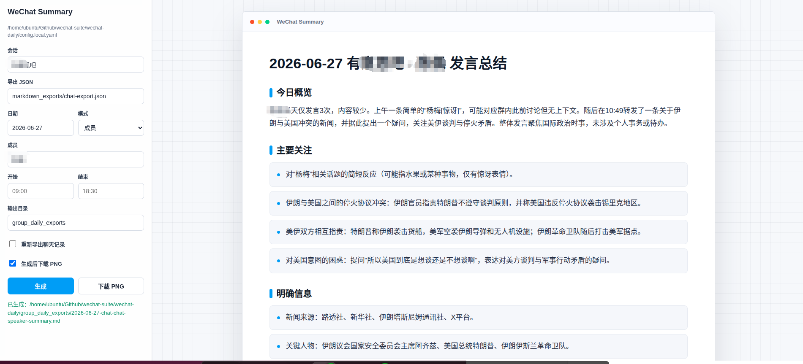

# WeChat Suite

WeChat Suite 是一个面向本地微信聊天记录的整理工具包。它把两个能力组合到一个仓库里：先从真实微信数据库导出聊天记录，再用大模型按天生成 Markdown 总结，并可渲染成PNG。

## 功能特性

- 从本地微信数据库导出指定群聊记录
- 按日期生成群聊日报 Markdown
- 生成微信个人对话总结
- 生成指定群聊中某个人的发言总结
- 支持按开始/结束时间筛选聊天记录，跨天时间段可写完整日期时间
- 提供本地浏览器操作页面，选择配置后点击生成
- 将总结 Markdown 转成PNG
- 支持 DeepSeek、NewAPI 以及 OpenAI 兼容接口
- 保留 `wechat-daily` 原有的控制台输出、Markdown 输出和 Notion 流程
- 将导出文件、日志、密钥和本地配置默认排除在 Git 之外

## 项目结构

```text
wechat-suite/
├── run.sh                    # Linux / macOS 一键运行入口
├── run.bat                   # Windows 一键运行入口
├── wechat-daily/             # 聊天总结、Markdown 生成、Notion 写入
└── wechat-decrypt/           # 微信数据库解密、会话查询、聊天导出
```

## 工作流程

```text
wechat-decrypt 导出指定群聊 JSON
  ↓
wechat-daily 读取 JSON 并筛选指定日期
  ↓
调用 DeepSeek / NewAPI / OpenAI 兼容模型
  ↓
生成 Markdown 总结，可选 PNG
```

## 环境要求

- Linux / Ubuntu、macOS、Windows
- Python 3.12+
- 已登录且有本地数据的微信客户端
- 可用的 DeepSeek、NewAPI 或其他 OpenAI 兼容模型 API Key
- 已完成 `wechat-decrypt` 所需的微信数据库密钥提取

## 平台兼容性

| 平台 | 当前可用性 | 说明 |
|---|---|---|
| Linux / Ubuntu | 支持，当前验证最多 | `./run.sh`、数据库导出和总结 Web UI 都按 Linux 环境验证 |
| macOS | 可用，但解密步骤更复杂 | `wechat-daily` 的总结和 Web UI 基本可用；`wechat-decrypt` 支持 macOS，但密钥提取通常需要退出微信、重签名 `/Applications/WeChat.app`、root 权限和编译 macOS 扫描器 |
| Windows | 支持 | 使用 `run.bat` 启动 Web UI；自动导出会查找 `wechat-decrypt\.venv\Scripts\python.exe`。密钥提取/解密仍需按 `wechat-decrypt` 的 Windows 流程准备，并以管理员权限读取微信进程内存 |

简短结论：已有导出 JSON 时三端都能跑总结；全链路自动导出时，Linux/Windows 入口已适配，macOS 主要难点在微信密钥提取权限。

## 安装依赖

分别进入两个子目录安装依赖。

```bash
cd wechat-decrypt
python3 -m venv .venv
.venv/bin/pip install -r requirements.txt
```

```bash
cd ../wechat-daily
python3 -m venv .venv
.venv/bin/pip install -r requirements.txt
```

Windows 可用 PowerShell / CMD：

```bat
cd wechat-decrypt
py -3 -m venv .venv
.venv\Scripts\python -m pip install -r requirements.txt

cd ..\wechat-daily
py -3 -m venv .venv
.venv\Scripts\python -m pip install -r requirements.txt
```

如果 `wechat-decrypt` 的完整依赖在你的环境里安装失败，可以先安装导出所需的最小依赖，例如 `pycryptodome`、`zstandard`、`tqdm`、`mcp`。

## 配置说明

### 1. 配置 wechat-decrypt

复制或编辑：

```bash
cp wechat-decrypt/config.example.json wechat-decrypt/config.json
```

然后填写你的微信数据目录、密钥文件路径等信息。也可以按 `wechat-decrypt` 原项目 README 的方式生成 `all_keys.json`。

### 2. 配置 wechat-daily

公开模板是：

```text
wechat-daily/config.yaml.example
```

本地私有配置建议放在：

```text
wechat-daily/config.local.yaml
```

`config.local.yaml` 已经被 `.gitignore` 忽略，不会提交到仓库。

最常改的是这几项：

```yaml
ai:
  provider: "deepseek"
  api_key: "YOUR_DEEPSEEK_API_KEY"
  model: "deepseek-chat"

# 使用 NewAPI 时：
# ai:
#   provider: "newapi"
#   api_key: "YOUR_NEWAPI_API_KEY"
#   model: "gpt-4o-mini"
#   base_url: "http://127.0.0.1:3000/v1"

chat_summary:
  chat_name: "Walk AI Coding"
  date: "2026-06-23"
  mode: "group"
  render_png: true
```

说明：

- `chat_summary.chat_name`：要总结的群聊名称、联系人显示名、备注名或 wxid
- `chat_summary.date`：要总结的日期，格式为 `YYYY-MM-DD`
- `chat_summary.mode`：`group` 群聊日报、`private` 个人对话总结、`speaker` 群内指定成员发言总结
- `chat_summary.speaker`：`mode: speaker` 时填写群内发言人的 sender 名称或 wxid
- `chat_summary.render_png`：是否额外生成PNG
- `ai.api_key`：你的模型 API Key
- `chat_summary.decrypt_repo`：默认是 `../wechat-decrypt`，通常不用改

## 一键运行

在仓库根目录运行：

```bash
./run.sh
```

Windows:

```bat
run.bat
```

脚本会启动本地 Web 页面，并自动优先读取：

```text
wechat-daily/config.local.yaml
```

如果没有本地配置，则回退到：

```text
wechat-daily/config.yaml
```

默认地址是：

```text
http://127.0.0.1:8765/
```

如果端口被占用，会自动尝试后续端口。页面里可以选择会话、模式、日期、时间段开关、是否重新导出聊天记录，然后点击生成；PNG 由浏览器直接下载，不需要 Playwright。

如果仍想使用原来的命令行流水线：

```bash
./run.sh --cli wechat-daily/config.local.yaml
```

Windows 命令行流水线：

```bat
run.bat --cli wechat-daily\config.local.yaml
```

## 浏览器操作页面

`./run.sh` 会启动本地 Web UI。左侧是配置区，右侧是生成后的 报告预览。



页面支持：

- 配置 AI Provider、API Key、模型、Base URL、Max Tokens
- 选择群聊、个人对话或群聊指定成员总结
- 填写日期、开始时间、结束时间
- 开启或关闭时间段筛选
- 选择已有导出 JSON，或勾选“重新导出聊天记录”
- 点击“生成”后预览 Markdown 总结
- 点击“下载 PNG”，由浏览器直接生成图片

高级配置只放解密仓库、导出接口这类低频连接项。浏览器生成 PNG 不需要安装 Playwright；只有命令行 `summarize_export_chat.py --png` 这一路径才需要 Playwright。

## 输出位置

运行后会生成两个目录：

```text
wechat-daily/markdown_exports/       # 中间 JSON 导出文件
wechat-daily/group_daily_exports/    # 最终 Markdown / PNG 总结
```

示例文件名：

```text
wechat-daily/markdown_exports/Walk_AI_Coding-export.json
wechat-daily/group_daily_exports/2026-06-23-Walk_AI_Coding-summary.md
wechat-daily/group_daily_exports/2026-06-23-Walk_AI_Coding-summary.png
```

## 常用命令

只改日期运行：

```bash
cd wechat-daily
./run_group_daily.sh config.local.yaml
```

使用原 `wechat-daily` 控制台输出：

```bash
cd wechat-daily
.venv/bin/python main.py --console --chat "群名" --date 2026-06-23
```

只生成 Markdown，不写 Notion：

```bash
cd wechat-daily
.venv/bin/python main.py --output-dir group_daily_exports --chat "群名" --date 2026-06-23
```

生成个人对话总结并导出 PNG：

```yaml
chat_summary:
  chat_name: "某联系人"
  date: "2026-06-23"
  mode: "private"
  start_time: "09:00"
  end_time: "18:30"
  render_png: true
  input_json: "markdown_exports/某联系人-export.json"
```

总结群聊里某个人的发言：

```yaml
chat_summary:
  chat_name: "Walk AI Coding"
  date: "2026-06-23"
  mode: "speaker"
  speaker: "Walk-gpt"
  start_time: "2026-06-23 23:30"
  end_time: "2026-06-24 02:00"
  render_png: true
  input_json: "markdown_exports/Walk_AI_Coding-export.json"
```

写入 `wechat-daily/config.local.yaml` 后，在仓库根目录执行 `./run.sh` 即可。
`start_time/end_time` 可留空；只写 `09:00` 时表示 `date` 当天，需要跨天时写完整日期时间。

如果使用命令行 `--png` 导出，首次运行前安装浏览器内核：

```bash
cd wechat-daily
.venv/bin/pip install -r requirements.txt
.venv/bin/python -m playwright install chromium
```

## 安全注意事项

- 不要提交真实的 `DeepSeek`、`NewAPI`、`OpenAI`、`Notion` API Key
- 不要提交 `all_keys.json`、`wxwork_keys.json`、微信数据库或导出的聊天记录
- `config.yaml`、`config.json`、`config.local.yaml`、导出目录和日志目录都已默认忽略
- 如果误把密钥提交过，请立即删除远端提交并轮换对应 API Key

## 已忽略的运行产物

- `wechat-daily/markdown_exports/`
- `wechat-daily/group_daily_exports/`
- `wechat-daily/logs/`
- `wechat-decrypt/decrypted/`
- `wechat-decrypt/wechat_files/`
- `all_keys.json`
- `config.yaml` / `config.json` / `config.local.yaml`

## 致谢

本仓库组合使用并保留了以下项目能力：

- `wechat-decrypt`：微信数据库解密与导出能力
- `wechat-daily`：聊天记录总结、任务提取与 Markdown / Notion 输出能力

## 许可证

本仓库采用 MIT License，详见 [LICENSE](/home/ubuntu/Github/wechat-suite/LICENSE)。
